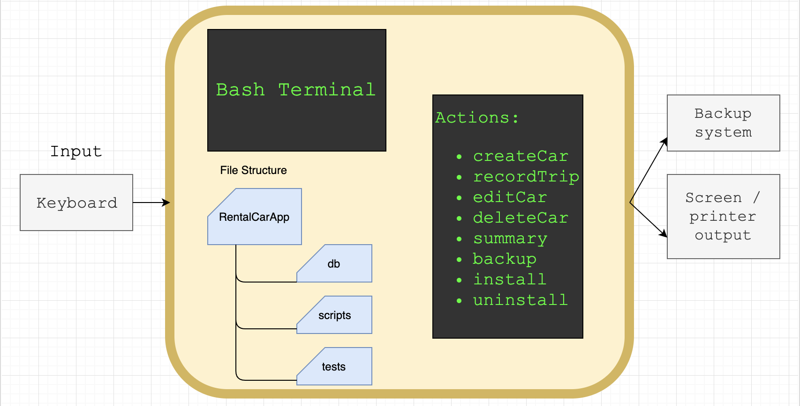
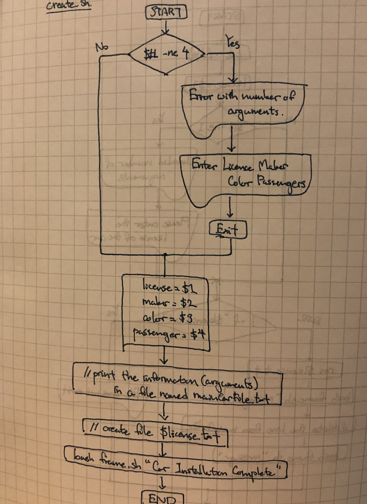
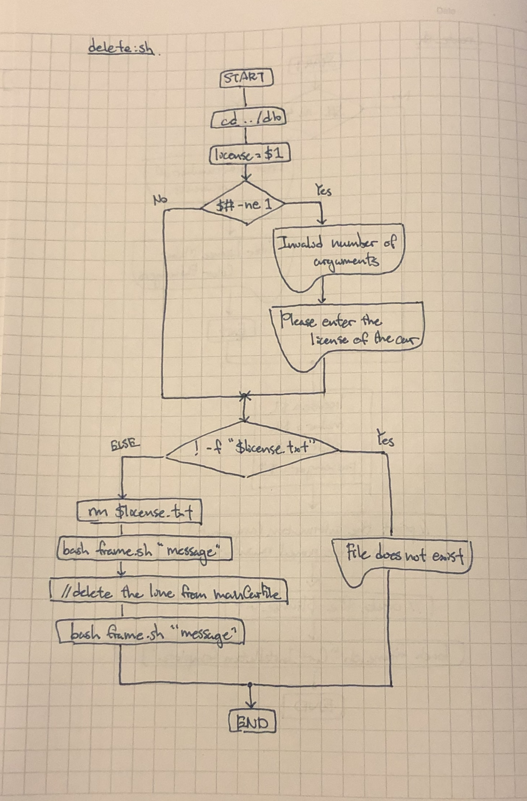
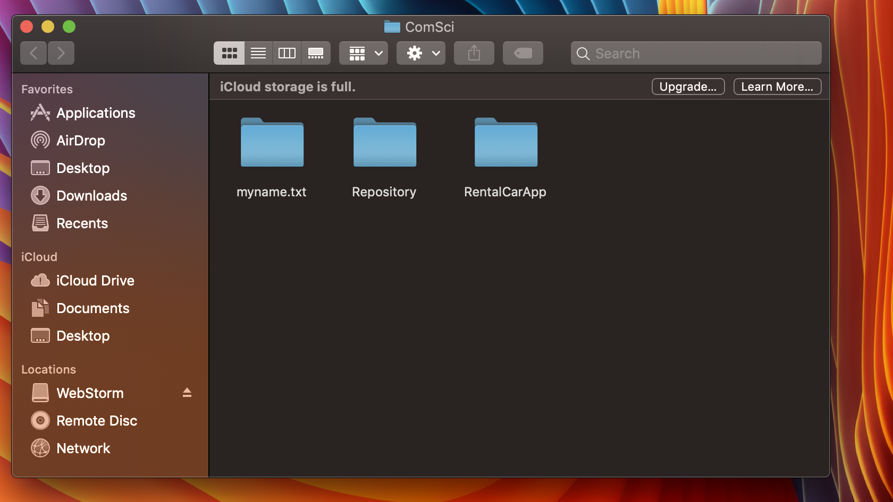

Car Rental Minimal App
===========================

A car rental management minimal app in Bash.

Contents
-----
  1. [Planning](#planning)
  1. [Design](#design)
  1. [Development](#development)
  1. [Evalution](#evaluation)

Planning
----------
### Defining the Problem (Topic 1.1.1)
The new system that we are going to create for the client is a program for recording information about the orders made by the customers. The car rental office would especially collect basic information about the distance driven for each car. This links with the syllabus 1.1.1 about "The context for which a new system is planned", because we are creating a new system of organizing car rental information. Since our client is a beginner in using computer, we need to create a program as simple as possible for our client. And while coding our program, we also need to think about the potential organizational issues that we will face through the process.

### Solution proposed
For this problem, the first thing we need to consider is the fact that our client is not used to using a computer. So what we need to do is to create a very simple program, like a one step program, so that even the people who don't understand the computer system are able to use without any difficulties. We first need a program that does the installation process of the car rental app, in one step. It should be something like, when the user types in "install", it should automatically create the folder in the desktop. It is preferable that there are 2 folders in the folder, one storing all the data of the cars, and the other for putting all the scripts of the program inside. It is necessary that we have a program that records the car information that the users enter, into the database folder. These programs, as mentioned before should be amde user-friendly, especially for our clients. Also there can be some additional functions such as editting the files, creating a backup, etc.

### Success Criteria
These are the measurable outcomes: 
1. A car can be created and stored in the database
2. A car information can be edited
3. A car can be deleted from the database 
4. The installation is ***simple -> one step process***
5. A summary (total/ average dustance travlled) can be generated for a particular car
6. Trips can be recorded and stored for an existing car
7. A basic database system is implemented
8. A basic backup functionaltiy is avialable 

Design
---------
### First sketch of the system 


**Fig. 1** First sketch of the system showing the main input/output components, actions, and software requirements.

### How the RentalCarApp works
The user will use their keyboard to input information that they want to store. Through all the actions that can be done in RentalCarApp, it allows the users to manipulate the information however they want to. The file structure of this RentalCarApp is inside the app folder, there are two folders; database folder and the scripts folder. The database folder is for the users to use. It stores every data the user inputs through their keyboard. The scripts folder contains all the code for the actions. The output for this program is screen / hard copy. The user can also backup all the information into for example a hard drive.

### Algorithm flow diagrams


**Fig. 2** First sketch of the flow diagram for the script where messages for the users are showed



**Fig. 3** Sketch of how the car installation program would work. 



**Fig. 4** Flow chart of how the delete program would work.


Development
--------
### 1. Script to install the app 
The following script creates the app folder and inside it creates two more folders: db and scripts.
```sh 
#!/bin/bash 

#This file creates the folder structure for the minimal Car Rental App

echo "Starting the installation"
echo "Enter the path where you want to install. Press Enter"

read path 

#Moving to the desired location 
cd ~/Desktop
echo "moving to $path"
 
#Create App folder 
mkdir CarRentalApp

#Create database/scripts folder inside the CarRentalApp
cd CarRentalApp
mkdir db 
mkdir scripts

echo "structure created successfully"
```

### 2. Code for showing message to the user
This program prints the message for the user in a box created
```sh 
#!/bin/bash

#Create variable for arguments
word=$1
#Check how many letters are in the argument
letters=${#word}

#Create a 100 x 5 rectangle made out of asterisk
for (( a=0; a<100; a++ ))
do
        echo -n "*"
done

echo
echo -n "*"
for (( b=0; b<98; b++ ))
do
    echo -n " "
done
echo -n "*"
echo
echo -n "*"
(( insert = (100 - $letters) / 2 - 1 ))
for (( b=0; b<$insert; b++ ))
do
    echo -n " "
done
echo -n $word
(( rest = 100 - ($insert + $letters + 2 )))
for (( b=0; b<rest; b++ ))
do
    echo -n " "
done
echo "*"
echo -n "*"
for (( b=0; b<98; b++ ))
do
    echo -n " "
done
echo -n "*"
echo

for (( a=0; a<100; a++ ))
do
    echo -n "*"
done
echo

```

### 3. Development of the function: Create a new car
1. Get inputs (Plates, Model, Color, Passenger number)
2. Check if the number of arguments are equal to 4 
3. Write to main file with one extra line without erasing other entries
4. Create car trip file with license plate.txt

```sh 
#!/bin/bash

if [ $# -ne 4 ]; then
        echo "Error with the number of arguments"
        echo "Enter License Maker Model Passengers"
        exit
fi

License=$1
Maker=$2
Model=$3
Pp=$4

echo "$License $Maker $Model $Pp" >> ~/Desktop/CarRentalApp/db/mainCarFile.txt
echo "" > ~/Desktop/CarRentalApp/db/$License.txt

bash frame "Installation Complete"
```


### 4. Development of another function: Record the trip information 
1. Check arguments (License, km, Dateout, Datein)
2. Check that the car exist 
3. If car exists, then write the trip info in the $License.txt file, without erasing previous trips 

```sh 
#!/bin/bash

#This program records the details (km, startOfTrip, endOfTrip) in the individual .txt files of the cars
if [ $# -ne 4 ]; then
        echo "Error with the number of arguments"
        echo "Enter the information in the following order: License Distance StartDayOfTrip EndDayOfTrip"
        exit
fi

License=$1
Distance=$2
StartDayOfTrip=$3
EndDayOfTrip=$4

#Check if the file exist
if [ ! -f $License.txt ]; then
        echo "Car does not exist"
        exit
fi
echo "$Distance $StartDayOfTrip $EndDayOfTrip" >> ~/Desktop/CarRentalApp/db/$License.txt
bash frame "Trip recorded successfully"
```


### 5. Development of Summary Action 
This code calculates the total distance of a particular car.
```sh 
#!/bin/bash

#This program summarizes the total distance of each car

#Step 1: Check the number of arguments
if [ $# -ne 1 ]; then
  echo "Invalid number of arguments!"
  echo "Please enter the license plate of the car"
fi

#Step 2: Check if the file exists in the database
cd ../db
FILE=$1
if [ ! -f "$FILE.txt" ]; then
  echo "File for car $FILE does not exist"
  exit
fi

#Step 3: calculate the total km
total=0
while read line
do
  for km in $line
  do
    (( total=$total+$km ))
    break
  done
done < "$FILE.txt"

#Step 4: Show result nicel y
cd ../scripts
bash frame.sh "Total distacne travel for $FILE was $total"
```


### 6. Development of the script Delete
This code uses arguments from the users. 
1. Checks if it has the correct number of arguments
2. Check if the file that the user is looking for exists 
3. If it does delete the car file, along the line of the car in the mainCarFile.txt 
```sh 
#!/bin/bash

#This program deleted the car file from db folder
#It also deletes car information from the mainCarFile.txt

cd ../db

#Check the number of arguments
license=$1
if [ $# -ne 1 ]; then
  echo "Invalid number of arguments!"
  echo "Please enter the license of the car"
fi

#Check if the .txt file exist
if [ ! -f "$license.txt" ]; then
  echo "File does not exist!"
else
  rm $license.txt
  bash ../scripts/frame.sh "The file was successfully deleted"
  #delete the line from the mainCarFile.txt
  sed -i '' "/$license/d" mainCarFile.txt
  bash ../scripts/frame.sh "The line was successfully deleted"
fi
exit
```


### 7. Development of the script Edit
This code should allow the user to edit the car file. 
1. Check if the number of arguments type in by the user is a valid number 
2. Check if the license number is an existing car 
3. If it exists delete the car information in the mainCarFile.txt and rewrite it with the new information given in arguments
```sh 
#!/bin/bash

#This program edit the information of an exiting car in the mainCarFile
#User enters [license plate] [maker] [color] [passenger]

if [ $# -ne 4 ]; then
  echo "Invalid number of arguments"
  echo "Enter License Maker Color Passengers"
  exit
fi

license=$1
maker=$2
color=$3
passenger=$4

cd ../db

#Check if the $license.txt exists
if [ ! -f "$license.txt" ]; then
  echo "File not found!"
  exit 
fi

#identify the line with the given license plate and delete it
sed -i '' "/^$license/d" mainCarFile.txt
#add the new information
echo "$license $maker $color $passenger" >> mainCarFile.txt
cd ../scripts
bash frame.sh "Car edited successfully"
```


### 8. Developing the uninstall.sh 
Program for uninstalling the RentalCarApp. 
1. Ask the user for confirmation 
2. If the user answers yes, remove RentalCarApp from the desktop 
```sh 
#!/bin/bash

#This program uninstalls the folders that was installed using the install.sh

echo "Are you sure you want to uninstall RentalCarApp?  (Enter: Y or N)"
read ans

#If yes, remove the RentalCarApp from the Desktop
if [ $ans = "Y" ]; then
  cd ~/Desktop
  rm -R RentalCarApp
  bash frame.sh "Uninstallation complete"
else
  bash frame.sh "RentalCarApp is still in Desktop"
  exit
fi
```


### 9. Developing a script for backup 
1. Get the location where the user wants to backup the RentalCarApp 
2. If valid number of arguments entered, copy the folder and move the copy to the desired location 
```sh 
#!/bin/#!/usr/bin/env bash

#This program creates a backup for the RentalCarApp folder

#Get argument of where the user wants to create a backup
location=$1

#Check if the number of the arguments are correct
if [ $# -ne 1 ]; then
  echo "Invalid path! Enter an existing path"
  echo "Backup falied"
else
  #Copy the RentalCarApp and put it the copy in another location
  cp -a ~/Desktop/RentalCarApp $location
  bash frame.sh "Backup succeeded"
fi
```


### 10. Development of the test script 
Test create script 
1. Go to the scripts folder and execute create.sh 
2. Check if the license.txt file exists
3. Check that the car was also created inside the mainCarFile.txt 

Test record script 
1. Go to the scripts folder and execute record.sh 
2. Check if the trip info was successfully added in the license.txt file 
```sh 
#!/bin/bash

#This program tests if the install.sh, create.sh, and record.sh functions correctly

#Step 1: Check if the create.sh fucntions correctly without error

#1.1 create a car using the script car
cd ../scripts
bash create.sh 80-49 nissan red 8

#1.2 Check if the license.txt file was created
if [ -f "../db/80-49.txt" ]; then
  echo "txt file of the car was created successfully"
else
  echo "Test failed"
fi

#1.3 check that the car was added to the main file
lastLine=$( tail -n 1 ../db/mainCarFile.txt )
if [ "80-49 nissan red 8" == "$lastLine" ]; then
  echo "Record was entered successfully"
else
  echo "Test failed"
fi


#Step 2: Check if the record.sh works without any malfunction

#2.1 record car trip information using script record
cd ../scripts
bash record.sh 80-49 4500 2019/08/21 2019/08/27

#2.2 Check if the car trip info was entered correctly inside the txt file
tripInfo=$( tail -n 1 ../db/80-49.txt )
if [ "4500 2019/08/21 2019/08/27" == "$tripInfo" ]; then
  echo "Trip Information was entered successfully"
else
  echo "Test failed"
fi
```


Evaluation
-----------

### Checking success criterias 
**1. A car can be created and stored in the database**

The test.sh code essentially checks if the car has been created successfully, in the mainCarFile.txt. It also checks if an individual .txt file for the car has been made and put into the db folder. The output of this program is this. 
```sh 
****************************************************************************************************
*                                                                                                  *
*                                    Car Installation Complete                                     *
*                                                                                                  *
****************************************************************************************************
txt file of the car was created successfully
Record was entered successfully
```
This shows that the create.sh is working without any errors. All the files that should've been created in the database is created correctly.

**2. A car information can be edited**

This is enabled by the edit.sh program. When the user want to edit the information that they already entered, they can type in "bash edit.sh", followed with the new information that they want to substitute the old onew with. It requires 4 arguments, the license plate, maker, color, and the number of passengers. This allows the user to update their car information, without deleting the car and creating another file every time. For example let's say the previous information in 40-67.txt was: 
```sh 
300 2018/09/11 2018/09/23
```
After the user type in: 
```sh 
bash edit.sh 40-67 450 2018/09/11 2018/09/25
```
The new information in the 40-67.txt should be changed accordingly to the new arguments.


**3. A car can be deleted from the database**

The users can also just delete the information, instead of changing them. The delete.sh allows the users to delete unnecessary information about the car. When the user types in "bash delete.sh $license" it finds the txt file with the license name that the user typed in as an argument, and delete the whole file. It also deletes the information from the mainCarFile.txt.


**4. The installation is ***simple -> one step process*****

For the script install, it has to be a one step, simple process for the user. The code that has been uploaded above, under the section "Script to install the app", is the install.sh, and this allows the user to install the RentalCarApp as simply as possible. When the user type in "bash install.sh", it automatically creates the folder in the desktop.


**5. A summary (total/ average dustance travlled) can be generated for a particular car**

This code makes the user able to calculate the total distance a particular car drove for. This is also user friendly in a way that the user only has to type in the license number and it calculates the total distance for us. The input from the user would be for example:
```sh 
bash summary.sh 40-67
```
If the 40-67.txt file data was as following: 
```sh 
300 2018/09/11 2018/09/23
4300 2018/09/25 2018/10/05
1900 2018/10/14 2018/10/31
```
Then the output of this program is this:
```sh 
****************************************************************************************************
*                                                                                                  *
*                             Total distacne travel for 40-67 was 6500                             *
*                                                                                                  *
****************************************************************************************************

```

**6. Trips can be recorded and stored for an existing car**

The reocord script is basically for doing this. It records the trip information that the user types in as arguments, and then those information automaitcally gets copied into the car file. When the user types in bash, command, arguments:
```sh 
bash record.sh 40-67 1900 2018/10/14 2018/10/31
****************************************************************************************************
*                                                                                                  *
*                                    Trip recorded successfully                                    *
*                                                                                                  *
****************************************************************************************************
```
This appears on the terminal. If we go to the 40-67.txt we will see that the file contains the new arguments the user typed in.

**7. A basic database system is implemented**

In the very first procedure of using the app, which is to install the RentalCarApp, it also installs the database older inside the RentalCarApp folder. This means that the basic database system is already implemented inofrst place.

**8. A basic backup functionaltiy is avialable**

The backup script allows the user to create a backup for the RentalCarApp. When the user types in for example: 
```sh 
 bash backup.sh ~/Documents/ComSci/
****************************************************************************************************
*                                                                                                  *
*                                         Backup succeeded                                         *
*                                                                                                  *
****************************************************************************************************
```
The user wanted to create a backup of this folder in the ComSci folder, located in the Documents folder. Let's check if it actually did that: 

It seems that that the folder has been backuped successfully!


**Summary:**
This program was developed by dynamic testing. dynamic testing is a way to develop a program 


